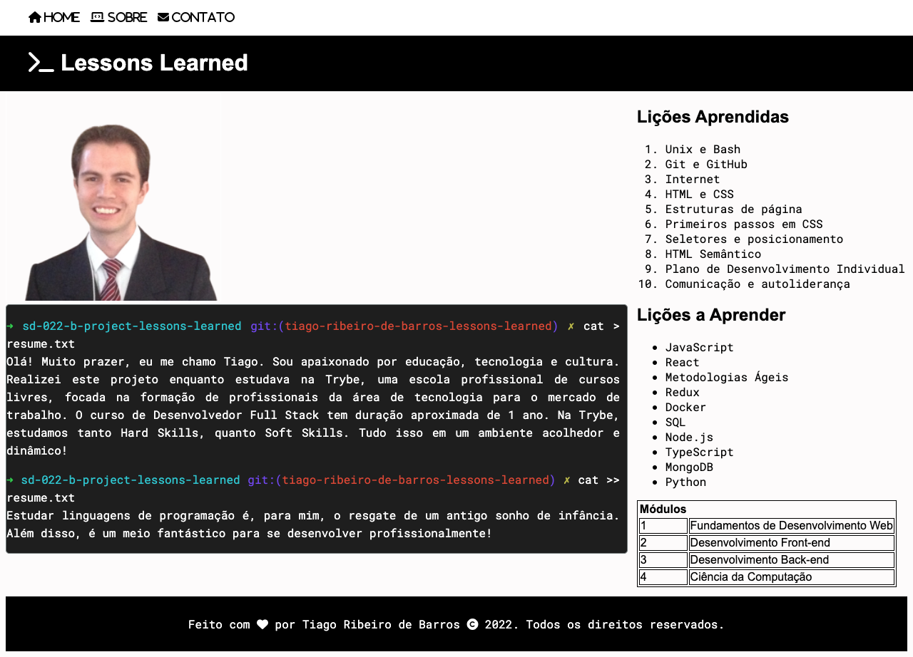

# Lessons Learned (Projeto) :books:

Projeto desenvolvido em HTML e CSS. Clique [aqui](https://tiagordebarros.github.io/projetos/lessons-learned/index.html) para visualizá-lo.

## Requisitos:

- [x] 1-Adicione uma cor de fundo específica para a página
- [x] 2-Adicione uma barra superior com um título
- [x] 3-Adicione uma foto sua à página
- [x] 4-Adicione uma lista de lições aprendidas à página
- [x] 5-Crie uma lista de lições que ainda deseja aprender para a página
- [x] 6-Adicione um rodapé para a página
- [x] 7-Insira pelo menos um link externo na página
- [x] 8-Crie um artigo sobre seu aprendizado
- [x] 9-Crie uma seção que conta uma passagem sobre seu aprendizado
- [x] 10-Aplique elementos HTML de acordo com o sentido e propósito de cada um deles
- [x] 11-Teste a semântica da sua página está aprovada pelo site CodeSniffer
- [x] 12-Adicione uma tabela à página
- [x] 13-Utilize o Box model
- [x] 14-Altere atributos relacionados as fontes
- [x] 15-Posicione o seu artigo e a seção sobre aprendizados um ao lado do outro

---

