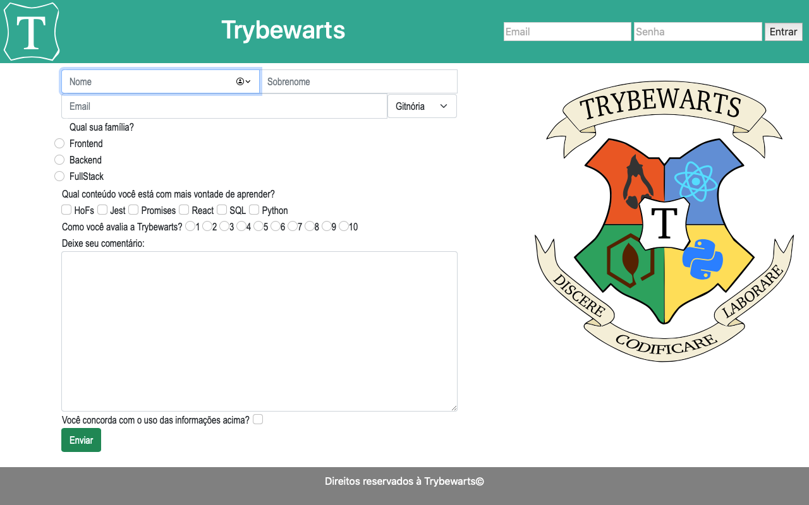

# Trybewarts (Projeto) :books:

Projeto desenvolvido em HTML, CSS e JavaScript. Clique [aqui](https://tiagordebarros.github.io/projetos/trybewarts/index.html) para visualizá-lo.

## Requisitos:

- [x] 1-Crie uma barra verde na parte superior da página
- [x] 2-Adicione o logotipo da Trybewarts com a classe trybewarts-header-logo na barra superior
- [x] 3-Acrescente um formulário de login no canto direito da barra superior contendo os inputs de email, senha e um botão de login
- [x] 4-Crie um título com o texto Trybewarts centralizado dentro do Header
- [x] 5-Adicione um formulário no corpo da página
- [x] 6-Faça com que o eixo principal do formulário seja vertical
- [x] 7-Adicione a logo da Trybewarts no lado direito da página
- [x] 8-Acrescente ao formulário com id evaluation-form os inputs de nome, sobrenome e email
- [x] 9-Acrescente ao formulário um select com o id house contendo as opções Gitnória, Reactpuff, Corvinode e Pytherina
- [x] 10-Posicione os campos de Nome e Sobrenome para que fiquem em linha
- [x] 11-Posicione os campos de Email e Casa para que fiquem em linha
- [x] 12-Acrescente ao formulário um campo de entrada para qual família a pessoa estudante se identifica
- [x] 13-Crie campos de entrada do tipo checkbox contendo seis opções
- [x] 14-Crie campo de entrada para avaliar de 1 a 10 o nível de satisfação com a Trybewarts
- [x] 15-Crie uma textarea com o id textarea e uma label com a classe textarea contendo o número máximo de caracteres igual à 500
- [x] 16-Crie um campo de entrada do tipo checkbox com o id agreement para validar as informações
- [x] 17-Crie um botão de Enviar para submeter o formulário
- [ ] 18-Faça com que o botão Enviar seja habilitado somente após a checkbox do requisito 16 ser selecionada
- [x] 19-Crie um rodapé no final da página
- [ ] 20-Crie um contador com o ID counter contendo o número de caracteres disponíveis no textarea, variando de 500 até 0, que deverá ser atualizado a medida que algo for digitado na textarea
- [ ] 21-Faça com que ao clicar no botão Enviar, o conteúdo do formulário seja substituído pelas informações preenchidas